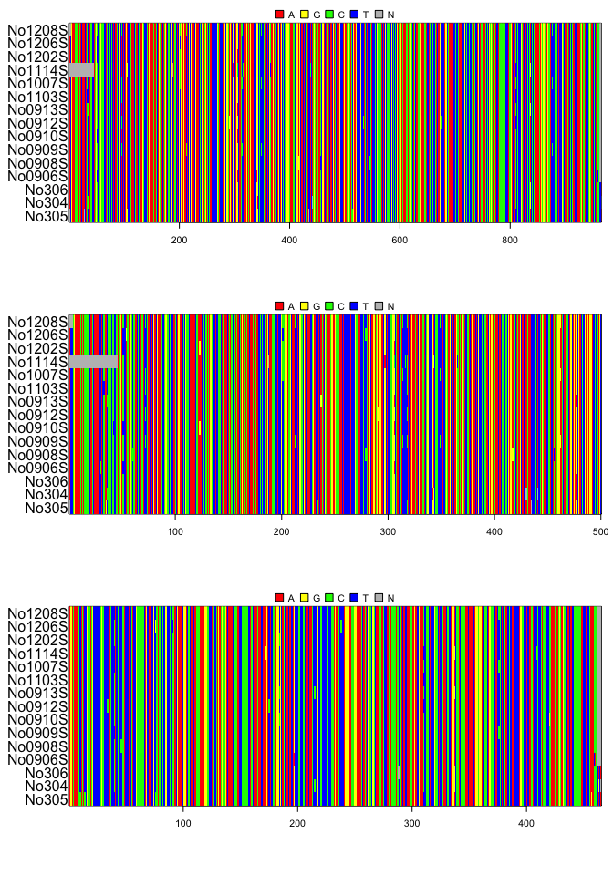
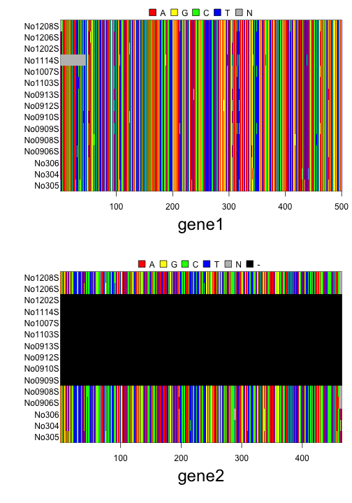
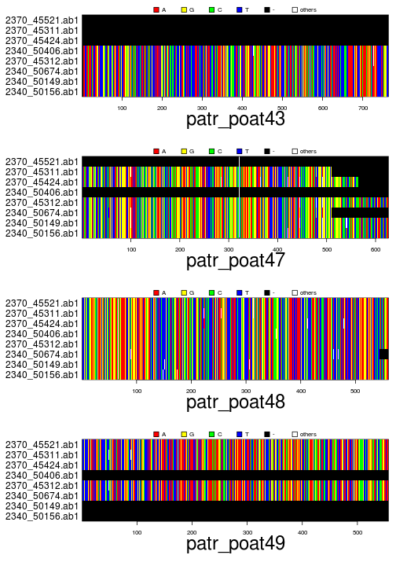
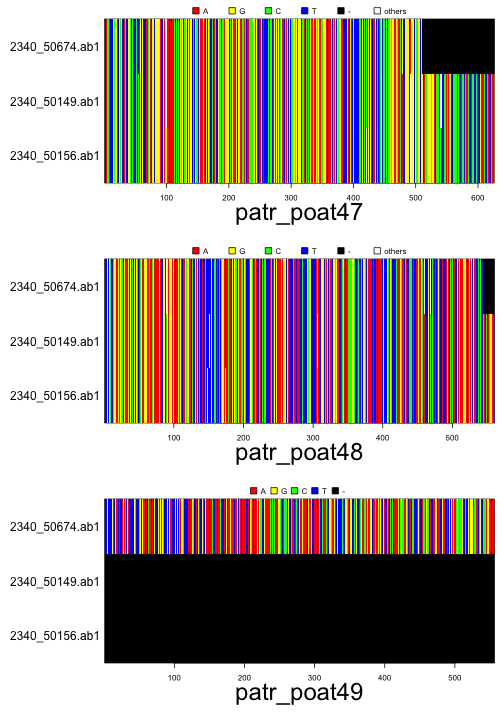
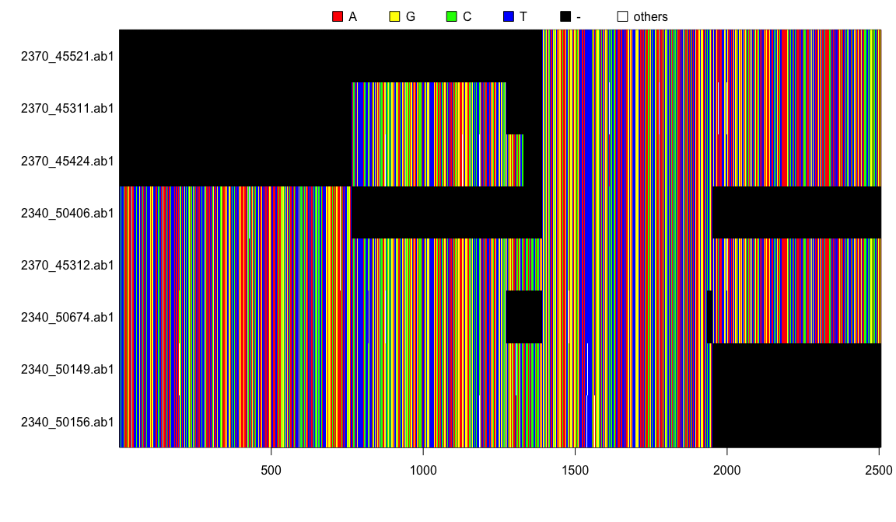
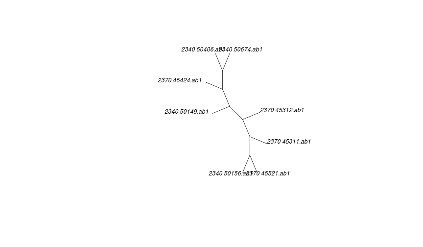
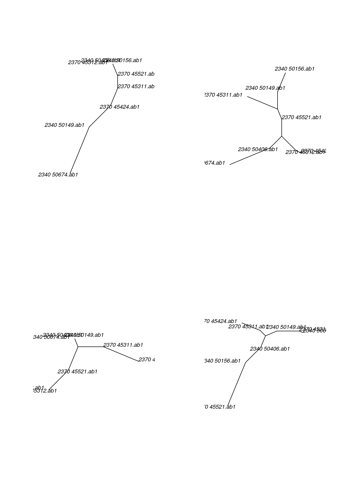
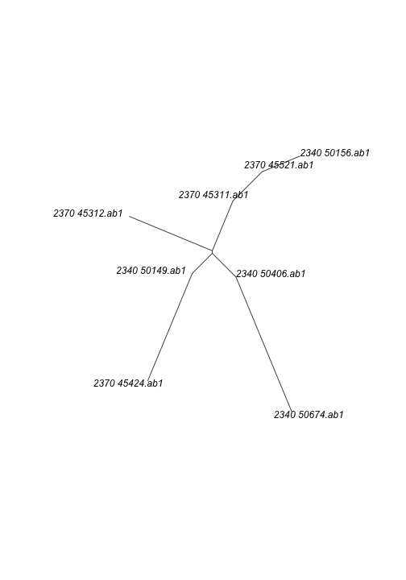

[](https://travis-ci.org/thibautjombart/apex)
[](http://dx.doi.org/10.5281/zenodo.16822)


*apex*: Phylogenetic Methods for Multiple Gene Data
=================================================
*apex* implements new classes and methods for analysing DNA sequences from multiple genes.
It implements new classes extending object classes from *ape* and *phangorn* to store multiple gene data, and some useful wrappers mimicking existing functionalities of these packages for multiple genes.
This document provides an overview of the package's content.


Installing *apex*
-------------
To install the development version from github:

```r
library(devtools)
install_github("thibautjombart/apex")
```

The stable version can be installed from CRAN using:

```r
install.packages("apex")
```

Then, to load the package, use:

```r
library("apex")
```


New object classes
------------------
Two new classes of object extend existing data structures for multiple genes:
* **multidna:** based on *ape*'s `DNAbin` class, useful for distance-based trees.
* **multiphyDat:** based on *phangorn*'s `phyDat` class, useful for likelihood-based and parsimony trees.
Conversion between these classes can be done using `multidna2multiPhydat` and `multiPhydat2multidna`.

###  multidna
This formal (S4) class can be seen as a multi-gene extension of *ape*'s `DNAbin` class.
Data is stored as a list of `DNAbin` objects, with additional slots for extra information.
The class definition can be obtained by:

```r
getClassDef("multidna")
```

```
## Class "multidna" [package "apex"]
## 
## Slots:
##                                                                           
## Name:               dna           labels            n.ind            n.seq
## Class:       listOrNULL        character          integer          integer
##                                                          
## Name:        n.seq.miss         ind.info        gene.info
## Class:          integer data.frameOrNULL data.frameOrNULL
## 
## Extends: "multiinfo"
```
* **@dna**: list of `DNAbin` matrices, each corresponding to a given gene/locus, with matching rows (individuals)
* **@labels**: labels of the individuals (rows of the matrices in `@dna`)
* **@n.ind**: the number of individuals
* **@n.seq**: the total number of sequences in the dataset, including gaps-only sequences
* **@n.seq.miss**: the total number of gaps-only (i.e., missing) sequences in the dataset
* **@ind.info**: an optional dataset storing individual metadata
* **@gene.info**: an optional dataset storing gene metadata

Any of these slots can be accessed using `@` (see example below).

New `multidna` objects can be created via two ways:

1. using the constructor `new("multidna", ...)`
2. reading data from files (see section on 'importing data' below)

We illustrate the use of the constructor below (see `?new.multidna`) for more information.
We use *ape*'s dataset *woodmouse*, which we artificially split in two 'genes', keeping the first 500 nucleotides for the first gene, and using the rest as second gene. Note that the individuals need not match across different genes: matching is handled by the constructor.

```r
## empty object
new("multidna")
```

```
## === multidna ===
## [ 0 DNA sequence in 0 gene ]
## 
## @n.ind: 0 individual
## @n.seq: 0 sequence in total
## @n.seq.miss: 0 gap-only (missing) sequence
## @labels:
```

```r
## using a list of genes as input
data(woodmouse)
woodmouse
```

```
## 15 DNA sequences in binary format stored in a matrix.
## 
## All sequences of same length: 965 
## 
## Labels: No305 No304 No306 No0906S No0908S No0909S ...
## 
## Base composition:
##     a     c     g     t 
## 0.307 0.261 0.126 0.306
```

```r
genes <- list(gene1=woodmouse[,1:500], gene2=woodmouse[,501:965])
x <- new("multidna", genes)
x
```

```
## === multidna ===
## [ 30 DNA sequences in 2 genes ]
## 
## @n.ind: 15 individuals
## @n.seq: 30 sequences in total
## @n.seq.miss: 0 gap-only (missing) sequence
## @labels: No305 No304 No306 No0906S No0908S No0909S...
## 
## @dna: (list of DNAbin matrices)
## $gene1
## 15 DNA sequences in binary format stored in a matrix.
## 
## All sequences of same length: 500 
## 
## Labels: No305 No304 No306 No0906S No0908S No0909S ...
## 
## Base composition:
##     a     c     g     t 
## 0.326 0.230 0.147 0.297 
## 
## $gene2
## 15 DNA sequences in binary format stored in a matrix.
## 
## All sequences of same length: 465 
## 
## Labels: No305 No304 No306 No0906S No0908S No0909S ...
## 
## Base composition:
##     a     c     g     t 
## 0.286 0.295 0.103 0.316
```

```r
## access the various slots
x@labels
```

```
##  [1] "No305"   "No304"   "No306"   "No0906S" "No0908S" "No0909S" "No0910S"
##  [8] "No0912S" "No0913S" "No1103S" "No1007S" "No1114S" "No1202S" "No1206S"
## [15] "No1208S"
```

```r
x@n.ind
```

```
## [1] 15
```

```r
class(x@dna) # this is a list
```

```
## [1] "list"
```

```r
names(x@dna) # names of the genes
```

```
## [1] "gene1" "gene2"
```

```r
x@dna[[1]] # first gene
```

```
## 15 DNA sequences in binary format stored in a matrix.
## 
## All sequences of same length: 500 
## 
## Labels: No305 No304 No306 No0906S No0908S No0909S ...
## 
## Base composition:
##     a     c     g     t 
## 0.326 0.230 0.147 0.297
```

```r
x@dna[[2]] # second gene
```

```
## 15 DNA sequences in binary format stored in a matrix.
## 
## All sequences of same length: 465 
## 
## Labels: No305 No304 No306 No0906S No0908S No0909S ...
## 
## Base composition:
##     a     c     g     t 
## 0.286 0.295 0.103 0.316
```

```r
## compare the input dataset and the new multidna
par(mfrow=c(3,1), mar=c(6,6,2,1))
image(woodmouse)
image(x@dna[[1]])
image(x@dna[[2]])
```



```r
## same but with missing sequences and wrong order
genes <- list(gene1=woodmouse[,1:500], gene2=woodmouse[c(5:1,14:15),501:965])
x <- new("multidna", genes)
x
```

```
## === multidna ===
## [ 30 DNA sequences in 2 genes ]
## 
## @n.ind: 15 individuals
## @n.seq: 30 sequences in total
## @n.seq.miss: 8 gap-only (missing) sequences
## @labels: No305 No304 No306 No0906S No0908S No0909S...
## 
## @dna: (list of DNAbin matrices)
## $gene1
## 15 DNA sequences in binary format stored in a matrix.
## 
## All sequences of same length: 500 
## 
## Labels: No305 No304 No306 No0906S No0908S No0909S ...
## 
## Base composition:
##     a     c     g     t 
## 0.326 0.230 0.147 0.297 
## 
## $gene2
## 15 DNA sequences in binary format stored in a matrix.
## 
## All sequences of same length: 465 
## 
## Labels: No305 No304 No306 No0906S No0908S No0909S ...
## 
## Base composition:
##     a     c     g     t 
## 0.286 0.294 0.103 0.316
```

```r
par(mar=c(6,6,2,1))
plot(x)
```




###  multiphyDat
Like `multidna` and *ape*'s `DNAbin`, the formal (S4) class `multiphyDat` is a multi-gene extension of *phangorn*'s `phyDat` class.
Data is stored as a list of `phyDat` objects, with additional slots for extra information.
The class definition can be obtained by:

```r
getClassDef("multiphyDat")
```

```
## Class "multiphyDat" [package "apex"]
## 
## Slots:
##                                                                           
## Name:               seq             type           labels            n.ind
## Class:       listOrNULL        character        character          integer
##                                                                           
## Name:             n.seq       n.seq.miss         ind.info        gene.info
## Class:          integer          integer data.frameOrNULL data.frameOrNULL
## 
## Extends: "multiinfo"
```
* **@seq**: list of `phyDat` objects, each corresponding to a given gene/locus, with matching rows (individuals); unlike `multidna` which is retrained to DNA sequences, this class can store any characters, including amino-acid sequences 
* **@type**: a character string indicating the type of sequences stored
* **@labels**: labels of the individuals (rows of the matrices in `@dna`)
* **@n.ind**: the number of individuals
* **@n.seq**: the total number of sequences in the dataset, including gaps-only sequences
* **@n.seq.miss**: the total number of gaps-only (i.e., missing) sequences in the dataset
* **@ind.info**: an optional dataset storing individual metadata
* **@gene.info**: an optional dataset storing gene metadata

Any of these slots can be accessed using `@` (see example below).

As for `multidna`, `multiphyDat` objects can be created via two ways:

1. using the constructor `new("multiphyDat", ...)`
2. reading data from files (see section on 'importing data' below)

As before, we illustrate the use of the constructor below (see `?new.multiphyDat`) for more information.

```r
data(Laurasiatherian)
Laurasiatherian
```

```
## 47 sequences with 3179 character and 1605 different site patterns.
## The states are a c g t
```

```r
## empty object
new("multiphyDat")
```

```
## === multiphyDat ===
## [ 0 DNA sequence in 0 gene ]
## 
## @type: 
## @n.ind: 0 individual
## @n.seq: 0 sequence in total
## @n.seq.miss: 0 gap-only (missing) sequence
## @labels:
```

```r
## simple conversion after artificially splitting data into 2 genes
genes <- list(gene1=subset(Laurasiatherian,,1:1600, FALSE),
      	 gene2=subset(Laurasiatherian,,1601:3179, FALSE))
x <- new("multiphyDat", genes, type="DNA")
```

```
## Warning: partial match of 'weight' to 'weights'

## Warning: partial match of 'weight' to 'weights'
```

```r
x
```

```
## === multiphyDat ===
## [ 94 DNA sequences in 2 genes ]
## 
## @type: DNA
## @n.ind: 47 individuals
## @n.seq: 94 sequences in total
## @n.seq.miss: 0 gap-only (missing) sequence
## @labels: Platypus Wallaroo Possum Bandicoot Opposum Armadillo...
## 
## @seq: (list of phyDat objects)
## $gene1
## 47 sequences with 1600 character and 827 different site patterns.
## The states are a c g t 
## 
## $gene2
## 47 sequences with 1579 character and 844 different site patterns.
## The states are a c g t
```


Importing data
--------------
### *ape* wrappers
Two simple functions permit to import data from multiple alignements into `multidna` objects:
* **read.multidna:** reads multiple DNA alignments with various formats
* **read.multiFASTA:** same for FASTA files

Both functions rely on the single-gene counterparts in *ape* and accept the same arguments.
Each file should contain data from a given gene, where sequences should be named after individual labels only.
Here is an example using a dataset from *apex*:

```r
## get address of the file within apex
files <- dir(system.file(package="apex"),patter="patr", full=TRUE)
files # this will change on your computer
```

```
## [1] "/usr/local/lib/R/site-library/apex/patr_poat43.fasta"
## [2] "/usr/local/lib/R/site-library/apex/patr_poat47.fasta"
## [3] "/usr/local/lib/R/site-library/apex/patr_poat48.fasta"
## [4] "/usr/local/lib/R/site-library/apex/patr_poat49.fasta"
```

```r
## read these files
x <- read.multiFASTA(files)
x
```

```
## === multidna ===
## [ 32 DNA sequences in 4 genes ]
## 
## @n.ind: 8 individuals
## @n.seq: 32 sequences in total
## @n.seq.miss: 8 gap-only (missing) sequences
## @labels: 2340_50156.ab1  2340_50149.ab1  2340_50674.ab1  2370_45312.ab1  2340_50406.ab1  2370_45424.ab1 ...
## 
## @dna: (list of DNAbin matrices)
## $patr_poat43
## 8 DNA sequences in binary format stored in a matrix.
## 
## All sequences of same length: 764 
## 
## Labels: 2340_50156.ab1  2340_50149.ab1  2340_50674.ab1  2370_45312.ab1  2340_50406.ab1  2370_45424.ab1  ...
## 
## Base composition:
##     a     c     g     t 
## 0.320 0.158 0.166 0.356 
## 
## $patr_poat47
## 8 DNA sequences in binary format stored in a matrix.
## 
## All sequences of same length: 626 
## 
## Labels: 2340_50156.ab1  2340_50149.ab1  2340_50674.ab1  2370_45312.ab1  2340_50406.ab1  2370_45424.ab1  ...
## 
## Base composition:
##     a     c     g     t 
## 0.227 0.252 0.256 0.266 
## 
## $patr_poat48
## 8 DNA sequences in binary format stored in a matrix.
## 
## All sequences of same length: 560 
## 
## Labels: 2340_50156.ab1  2340_50149.ab1  2340_50674.ab1  2370_45312.ab1  2340_50406.ab1  2370_45424.ab1  ...
## 
## Base composition:
##     a     c     g     t 
## 0.305 0.185 0.182 0.327 
## 
## $patr_poat49
## 8 DNA sequences in binary format stored in a matrix.
## 
## All sequences of same length: 556 
## 
## Labels: 2340_50156.ab1  2340_50149.ab1  2340_50674.ab1  2370_45312.ab1  2340_50406.ab1  2370_45424.ab1  ...
## 
## Base composition:
##     a     c     g     t 
## 0.344 0.149 0.187 0.320
```

```r
names(x@dna) # names of the genes
```

```
## [1] "patr_poat43" "patr_poat47" "patr_poat48" "patr_poat49"
```

```r
par(mar=c(6,11,2,1))
plot(x)
```



### *phangorn* wrappers
In addition to the above functions for importing data:
* **read.multiphyDat:** reads multiple DNA alignments with various formats.
The arguments are the same as the single-gene `read.phyDat` in *phangorn*:

```r
z <- read.multiphyDat(files, format="fasta")
```

```
## Warning: partial match of 'weight' to 'weights'

## Warning: partial match of 'weight' to 'weights'

## Warning: partial match of 'weight' to 'weights'

## Warning: partial match of 'weight' to 'weights'

## Warning: partial match of 'weight' to 'weights'

## Warning: partial match of 'weight' to 'weights'

## Warning: partial match of 'weight' to 'weights'

## Warning: partial match of 'weight' to 'weights'
```

```r
z
```

```
## === multiphyDat ===
## [ 32 DNA sequences in 4 genes ]
## 
## @type: 
## @n.ind: 8 individuals
## @n.seq: 32 sequences in total
## @n.seq.miss: 8 gap-only (missing) sequences
## @labels: 2340_50156.ab1  2340_50149.ab1  2340_50674.ab1  2370_45312.ab1  2340_50406.ab1  2370_45424.ab1 ...
## 
## @seq: (list of phyDat objects)
## $patr_poat43
## 8 sequences with 764 character and 8 different site patterns.
## The states are a c g t 
## 
## $patr_poat47
## 8 sequences with 626 character and 29 different site patterns.
## The states are a c g t 
## 
## $patr_poat48
## 8 sequences with 560 character and 24 different site patterns.
## The states are a c g t 
## 
## $patr_poat49
## 8 sequences with 556 character and 8 different site patterns.
## The states are a c g t
```


Handling data
--------------
Several functions facilitate data handling:
* **concatenate:** concatenate several genes into a single DNAbin or phyDat matrix
* **x[i,j]:** subset x by individuals (i) and/or genes (j)
* **multidna2multiphyDat:** converts from `multidna` to `multiphyDat`
* **multiphyDat2multidna:** converts from `multiphyDat` to `multidna`


Example code:

```r
files <- dir(system.file(package="apex"),patter="patr", full=TRUE)
files
```

```
## [1] "/usr/local/lib/R/site-library/apex/patr_poat43.fasta"
## [2] "/usr/local/lib/R/site-library/apex/patr_poat47.fasta"
## [3] "/usr/local/lib/R/site-library/apex/patr_poat48.fasta"
## [4] "/usr/local/lib/R/site-library/apex/patr_poat49.fasta"
```

```r
## read files
x <- read.multiFASTA(files)
x
```

```
## === multidna ===
## [ 32 DNA sequences in 4 genes ]
## 
## @n.ind: 8 individuals
## @n.seq: 32 sequences in total
## @n.seq.miss: 8 gap-only (missing) sequences
## @labels: 2340_50156.ab1  2340_50149.ab1  2340_50674.ab1  2370_45312.ab1  2340_50406.ab1  2370_45424.ab1 ...
## 
## @dna: (list of DNAbin matrices)
## $patr_poat43
## 8 DNA sequences in binary format stored in a matrix.
## 
## All sequences of same length: 764 
## 
## Labels: 2340_50156.ab1  2340_50149.ab1  2340_50674.ab1  2370_45312.ab1  2340_50406.ab1  2370_45424.ab1  ...
## 
## Base composition:
##     a     c     g     t 
## 0.320 0.158 0.166 0.356 
## 
## $patr_poat47
## 8 DNA sequences in binary format stored in a matrix.
## 
## All sequences of same length: 626 
## 
## Labels: 2340_50156.ab1  2340_50149.ab1  2340_50674.ab1  2370_45312.ab1  2340_50406.ab1  2370_45424.ab1  ...
## 
## Base composition:
##     a     c     g     t 
## 0.227 0.252 0.256 0.266 
## 
## $patr_poat48
## 8 DNA sequences in binary format stored in a matrix.
## 
## All sequences of same length: 560 
## 
## Labels: 2340_50156.ab1  2340_50149.ab1  2340_50674.ab1  2370_45312.ab1  2340_50406.ab1  2370_45424.ab1  ...
## 
## Base composition:
##     a     c     g     t 
## 0.305 0.185 0.182 0.327 
## 
## $patr_poat49
## 8 DNA sequences in binary format stored in a matrix.
## 
## All sequences of same length: 556 
## 
## Labels: 2340_50156.ab1  2340_50149.ab1  2340_50674.ab1  2370_45312.ab1  2340_50406.ab1  2370_45424.ab1  ...
## 
## Base composition:
##     a     c     g     t 
## 0.344 0.149 0.187 0.320
```

```r
par(mar=c(6,11,2,1))
plot(x)
```


```r
## subset
plot(x[1:3,2:4])
```



```r
## concatenate
y <- concatenate(x)
y
```

```
## 8 DNA sequences in binary format stored in a matrix.
## 
## All sequences of same length: 2506 
## 
## Labels: 2340_50156.ab1  2340_50149.ab1  2340_50674.ab1  2370_45312.ab1  2340_50406.ab1  2370_45424.ab1  ...
## 
## Base composition:
##     a     c     g     t 
## 0.298 0.187 0.197 0.319
```

```r
par(mar=c(5,8,2,1))
image(y)
```



```r
## concatenate multiphyDat object
z <- multidna2multiphyDat(x)
```

```
## Warning: partial match of 'weight' to 'weights'

## Warning: partial match of 'weight' to 'weights'

## Warning: partial match of 'weight' to 'weights'

## Warning: partial match of 'weight' to 'weights'

## Warning: partial match of 'weight' to 'weights'

## Warning: partial match of 'weight' to 'weights'

## Warning: partial match of 'weight' to 'weights'

## Warning: partial match of 'weight' to 'weights'
```

```r
u <- concatenate(z)
```

```
## Warning: partial match of 'weight' to 'weights'

## Warning: partial match of 'weight' to 'weights'

## Warning: partial match of 'weight' to 'weights'

## Warning: partial match of 'weight' to 'weights'

## Warning: partial match of 'weight' to 'weights'
```

```r
u
```

```
## 8 sequences with 2506 character and 69 different site patterns.
## The states are a c g t
```

```r
tree <- pratchet(u, trace=0)
```

```
## Warning: partial match of 'tip' to 'tip.label'

## Warning: partial match of 'weight' to 'weights'
```

```
## Warning: partial match of 'tip' to 'tip.label'
```

```
## Warning: partial match of 'weight' to 'weights'
```

```
## Warning: partial match of 'tip' to 'tip.label'
```

```
## Warning: partial match of 'weight' to 'weights'
```

```
## Warning: partial match of 'tip' to 'tip.label'

## Warning: partial match of 'tip' to 'tip.label'

## Warning: partial match of 'tip' to 'tip.label'

## Warning: partial match of 'tip' to 'tip.label'

## Warning: partial match of 'tip' to 'tip.label'

## Warning: partial match of 'tip' to 'tip.label'

## Warning: partial match of 'tip' to 'tip.label'

## Warning: partial match of 'tip' to 'tip.label'

## Warning: partial match of 'tip' to 'tip.label'
```

```
## Warning: partial match of 'weight' to 'weights'
```

```
## Warning: partial match of 'tip' to 'tip.label'
```

```
## Warning: partial match of 'weight' to 'weights'
```

```
## Warning: partial match of 'tip' to 'tip.label'
```

```
## Warning: partial match of 'weight' to 'weights'
```

```
## Warning: partial match of 'tip' to 'tip.label'

## Warning: partial match of 'tip' to 'tip.label'

## Warning: partial match of 'tip' to 'tip.label'

## Warning: partial match of 'tip' to 'tip.label'

## Warning: partial match of 'tip' to 'tip.label'

## Warning: partial match of 'tip' to 'tip.label'

## Warning: partial match of 'tip' to 'tip.label'

## Warning: partial match of 'tip' to 'tip.label'
```

```
## Warning: partial match of 'weight' to 'weights'
```

```
## Warning: partial match of 'tip' to 'tip.label'
```

```
## Warning: partial match of 'weight' to 'weights'
```

```
## Warning: partial match of 'tip' to 'tip.label'
```

```
## Warning: partial match of 'weight' to 'weights'
```

```
## Warning: partial match of 'tip' to 'tip.label'

## Warning: partial match of 'tip' to 'tip.label'

## Warning: partial match of 'tip' to 'tip.label'

## Warning: partial match of 'tip' to 'tip.label'

## Warning: partial match of 'tip' to 'tip.label'

## Warning: partial match of 'tip' to 'tip.label'

## Warning: partial match of 'tip' to 'tip.label'

## Warning: partial match of 'tip' to 'tip.label'

## Warning: partial match of 'tip' to 'tip.label'

## Warning: partial match of 'tip' to 'tip.label'

## Warning: partial match of 'tip' to 'tip.label'

## Warning: partial match of 'tip' to 'tip.label'
```

```
## Warning: partial match of 'weight' to 'weights'
```

```
## Warning: partial match of 'tip' to 'tip.label'
```

```
## Warning: partial match of 'weight' to 'weights'
```

```
## Warning: partial match of 'tip' to 'tip.label'
```

```
## Warning: partial match of 'weight' to 'weights'
```

```
## Warning: partial match of 'tip' to 'tip.label'

## Warning: partial match of 'tip' to 'tip.label'

## Warning: partial match of 'tip' to 'tip.label'

## Warning: partial match of 'tip' to 'tip.label'

## Warning: partial match of 'tip' to 'tip.label'

## Warning: partial match of 'tip' to 'tip.label'

## Warning: partial match of 'tip' to 'tip.label'

## Warning: partial match of 'tip' to 'tip.label'

## Warning: partial match of 'tip' to 'tip.label'

## Warning: partial match of 'tip' to 'tip.label'

## Warning: partial match of 'tip' to 'tip.label'

## Warning: partial match of 'tip' to 'tip.label'
```

```
## Warning: partial match of 'weight' to 'weights'
```

```
## Warning: partial match of 'tip' to 'tip.label'
```

```
## Warning: partial match of 'weight' to 'weights'
```

```
## Warning: partial match of 'tip' to 'tip.label'
```

```
## Warning: partial match of 'weight' to 'weights'
```

```
## Warning: partial match of 'tip' to 'tip.label'

## Warning: partial match of 'tip' to 'tip.label'

## Warning: partial match of 'tip' to 'tip.label'

## Warning: partial match of 'tip' to 'tip.label'

## Warning: partial match of 'tip' to 'tip.label'

## Warning: partial match of 'tip' to 'tip.label'

## Warning: partial match of 'tip' to 'tip.label'

## Warning: partial match of 'tip' to 'tip.label'

## Warning: partial match of 'tip' to 'tip.label'

## Warning: partial match of 'tip' to 'tip.label'

## Warning: partial match of 'tip' to 'tip.label'

## Warning: partial match of 'tip' to 'tip.label'

## Warning: partial match of 'tip' to 'tip.label'

## Warning: partial match of 'tip' to 'tip.label'

## Warning: partial match of 'tip' to 'tip.label'

## Warning: partial match of 'tip' to 'tip.label'

## Warning: partial match of 'tip' to 'tip.label'

## Warning: partial match of 'tip' to 'tip.label'
```

```
## Warning: partial match of 'weight' to 'weights'
```

```
## Warning: partial match of 'tip' to 'tip.label'
```

```
## Warning: partial match of 'weight' to 'weights'
```

```
## Warning: partial match of 'tip' to 'tip.label'
```

```
## Warning: partial match of 'weight' to 'weights'
```

```
## Warning: partial match of 'tip' to 'tip.label'

## Warning: partial match of 'tip' to 'tip.label'

## Warning: partial match of 'tip' to 'tip.label'

## Warning: partial match of 'tip' to 'tip.label'

## Warning: partial match of 'tip' to 'tip.label'

## Warning: partial match of 'tip' to 'tip.label'

## Warning: partial match of 'tip' to 'tip.label'

## Warning: partial match of 'tip' to 'tip.label'
```

```
## Warning: partial match of 'weight' to 'weights'
```

```
## Warning: partial match of 'tip' to 'tip.label'
```

```
## Warning: partial match of 'weight' to 'weights'
```

```
## Warning: partial match of 'tip' to 'tip.label'
```

```
## Warning: partial match of 'weight' to 'weights'
```

```
## Warning: partial match of 'tip' to 'tip.label'

## Warning: partial match of 'tip' to 'tip.label'

## Warning: partial match of 'tip' to 'tip.label'

## Warning: partial match of 'tip' to 'tip.label'

## Warning: partial match of 'tip' to 'tip.label'

## Warning: partial match of 'tip' to 'tip.label'

## Warning: partial match of 'tip' to 'tip.label'

## Warning: partial match of 'tip' to 'tip.label'

## Warning: partial match of 'tip' to 'tip.label'

## Warning: partial match of 'tip' to 'tip.label'

## Warning: partial match of 'tip' to 'tip.label'

## Warning: partial match of 'tip' to 'tip.label'

## Warning: partial match of 'tip' to 'tip.label'

## Warning: partial match of 'tip' to 'tip.label'

## Warning: partial match of 'tip' to 'tip.label'

## Warning: partial match of 'tip' to 'tip.label'
```

```
## Warning: partial match of 'weight' to 'weights'
```

```
## Warning: partial match of 'tip' to 'tip.label'
```

```
## Warning: partial match of 'weight' to 'weights'
```

```
## Warning: partial match of 'tip' to 'tip.label'
```

```
## Warning: partial match of 'weight' to 'weights'
```

```
## Warning: partial match of 'tip' to 'tip.label'

## Warning: partial match of 'tip' to 'tip.label'

## Warning: partial match of 'tip' to 'tip.label'

## Warning: partial match of 'tip' to 'tip.label'

## Warning: partial match of 'tip' to 'tip.label'

## Warning: partial match of 'tip' to 'tip.label'

## Warning: partial match of 'tip' to 'tip.label'

## Warning: partial match of 'tip' to 'tip.label'

## Warning: partial match of 'tip' to 'tip.label'

## Warning: partial match of 'tip' to 'tip.label'

## Warning: partial match of 'tip' to 'tip.label'

## Warning: partial match of 'tip' to 'tip.label'
```

```
## Warning: partial match of 'weight' to 'weights'
```

```
## Warning: partial match of 'tip' to 'tip.label'
```

```
## Warning: partial match of 'weight' to 'weights'
```

```
## Warning: partial match of 'tip' to 'tip.label'
```

```
## Warning: partial match of 'weight' to 'weights'
```

```
## Warning: partial match of 'tip' to 'tip.label'

## Warning: partial match of 'tip' to 'tip.label'

## Warning: partial match of 'tip' to 'tip.label'

## Warning: partial match of 'tip' to 'tip.label'

## Warning: partial match of 'tip' to 'tip.label'

## Warning: partial match of 'tip' to 'tip.label'

## Warning: partial match of 'tip' to 'tip.label'

## Warning: partial match of 'tip' to 'tip.label'

## Warning: partial match of 'tip' to 'tip.label'

## Warning: partial match of 'tip' to 'tip.label'

## Warning: partial match of 'tip' to 'tip.label'

## Warning: partial match of 'tip' to 'tip.label'

## Warning: partial match of 'tip' to 'tip.label'

## Warning: partial match of 'tip' to 'tip.label'

## Warning: partial match of 'tip' to 'tip.label'

## Warning: partial match of 'tip' to 'tip.label'

## Warning: partial match of 'tip' to 'tip.label'

## Warning: partial match of 'tip' to 'tip.label'

## Warning: partial match of 'tip' to 'tip.label'

## Warning: partial match of 'tip' to 'tip.label'
```

```
## Warning: partial match of 'weight' to 'weights'
```

```
## Warning: partial match of 'tip' to 'tip.label'
```

```
## Warning: partial match of 'weight' to 'weights'
```

```
## Warning: partial match of 'tip' to 'tip.label'
```

```
## Warning: partial match of 'weight' to 'weights'
```

```
## Warning: partial match of 'tip' to 'tip.label'

## Warning: partial match of 'tip' to 'tip.label'

## Warning: partial match of 'tip' to 'tip.label'

## Warning: partial match of 'tip' to 'tip.label'

## Warning: partial match of 'tip' to 'tip.label'

## Warning: partial match of 'tip' to 'tip.label'

## Warning: partial match of 'tip' to 'tip.label'

## Warning: partial match of 'tip' to 'tip.label'

## Warning: partial match of 'tip' to 'tip.label'

## Warning: partial match of 'tip' to 'tip.label'

## Warning: partial match of 'tip' to 'tip.label'

## Warning: partial match of 'tip' to 'tip.label'
```

```
## Warning: partial match of 'weight' to 'weights'
```

```
## Warning: partial match of 'tip' to 'tip.label'
```

```
## Warning: partial match of 'weight' to 'weights'
```

```
## Warning: partial match of 'tip' to 'tip.label'
```

```
## Warning: partial match of 'weight' to 'weights'
```

```
## Warning: partial match of 'tip' to 'tip.label'

## Warning: partial match of 'tip' to 'tip.label'

## Warning: partial match of 'tip' to 'tip.label'

## Warning: partial match of 'tip' to 'tip.label'

## Warning: partial match of 'tip' to 'tip.label'

## Warning: partial match of 'tip' to 'tip.label'

## Warning: partial match of 'tip' to 'tip.label'

## Warning: partial match of 'tip' to 'tip.label'

## Warning: partial match of 'tip' to 'tip.label'

## Warning: partial match of 'tip' to 'tip.label'

## Warning: partial match of 'tip' to 'tip.label'

## Warning: partial match of 'tip' to 'tip.label'

## Warning: partial match of 'tip' to 'tip.label'

## Warning: partial match of 'tip' to 'tip.label'

## Warning: partial match of 'tip' to 'tip.label'

## Warning: partial match of 'tip' to 'tip.label'

## Warning: partial match of 'tip' to 'tip.label'

## Warning: partial match of 'tip' to 'tip.label'

## Warning: partial match of 'tip' to 'tip.label'

## Warning: partial match of 'tip' to 'tip.label'

## Warning: partial match of 'tip' to 'tip.label'

## Warning: partial match of 'tip' to 'tip.label'

## Warning: partial match of 'tip' to 'tip.label'

## Warning: partial match of 'tip' to 'tip.label'

## Warning: partial match of 'tip' to 'tip.label'

## Warning: partial match of 'tip' to 'tip.label'

## Warning: partial match of 'tip' to 'tip.label'

## Warning: partial match of 'tip' to 'tip.label'

## Warning: partial match of 'tip' to 'tip.label'

## Warning: partial match of 'tip' to 'tip.label'

## Warning: partial match of 'tip' to 'tip.label'

## Warning: partial match of 'tip' to 'tip.label'

## Warning: partial match of 'tip' to 'tip.label'

## Warning: partial match of 'tip' to 'tip.label'

## Warning: partial match of 'tip' to 'tip.label'

## Warning: partial match of 'tip' to 'tip.label'
```

```
## Warning: partial match of 'weight' to 'weights'
```

```
## Warning: partial match of 'tip' to 'tip.label'
```

```
## Warning: partial match of 'weight' to 'weights'
```

```
## Warning: partial match of 'tip' to 'tip.label'
```

```
## Warning: partial match of 'weight' to 'weights'
```

```
## Warning: partial match of 'tip' to 'tip.label'

## Warning: partial match of 'tip' to 'tip.label'

## Warning: partial match of 'tip' to 'tip.label'

## Warning: partial match of 'tip' to 'tip.label'

## Warning: partial match of 'tip' to 'tip.label'

## Warning: partial match of 'tip' to 'tip.label'

## Warning: partial match of 'tip' to 'tip.label'

## Warning: partial match of 'tip' to 'tip.label'
```

```
## Warning: partial match of 'weight' to 'weights'
```

```
## Warning: partial match of 'tip' to 'tip.label'
```

```
## Warning: partial match of 'weight' to 'weights'
```

```
## Warning: partial match of 'tip' to 'tip.label'
```

```
## Warning: partial match of 'weight' to 'weights'
```

```
## Warning: partial match of 'tip' to 'tip.label'

## Warning: partial match of 'tip' to 'tip.label'

## Warning: partial match of 'tip' to 'tip.label'

## Warning: partial match of 'tip' to 'tip.label'

## Warning: partial match of 'tip' to 'tip.label'

## Warning: partial match of 'tip' to 'tip.label'

## Warning: partial match of 'tip' to 'tip.label'

## Warning: partial match of 'tip' to 'tip.label'

## Warning: partial match of 'tip' to 'tip.label'

## Warning: partial match of 'tip' to 'tip.label'

## Warning: partial match of 'tip' to 'tip.label'

## Warning: partial match of 'tip' to 'tip.label'

## Warning: partial match of 'tip' to 'tip.label'

## Warning: partial match of 'tip' to 'tip.label'

## Warning: partial match of 'tip' to 'tip.label'

## Warning: partial match of 'tip' to 'tip.label'

## Warning: partial match of 'tip' to 'tip.label'

## Warning: partial match of 'tip' to 'tip.label'

## Warning: partial match of 'tip' to 'tip.label'

## Warning: partial match of 'tip' to 'tip.label'

## Warning: partial match of 'tip' to 'tip.label'

## Warning: partial match of 'tip' to 'tip.label'

## Warning: partial match of 'tip' to 'tip.label'

## Warning: partial match of 'tip' to 'tip.label'

## Warning: partial match of 'tip' to 'tip.label'

## Warning: partial match of 'tip' to 'tip.label'

## Warning: partial match of 'tip' to 'tip.label'

## Warning: partial match of 'tip' to 'tip.label'

## Warning: partial match of 'tip' to 'tip.label'

## Warning: partial match of 'tip' to 'tip.label'

## Warning: partial match of 'tip' to 'tip.label'

## Warning: partial match of 'tip' to 'tip.label'

## Warning: partial match of 'tip' to 'tip.label'

## Warning: partial match of 'tip' to 'tip.label'

## Warning: partial match of 'tip' to 'tip.label'

## Warning: partial match of 'tip' to 'tip.label'
```

```
## Warning: partial match of 'weight' to 'weights'
```

```
## Warning: partial match of 'tip' to 'tip.label'
```

```
## Warning: partial match of 'weight' to 'weights'
```

```
## Warning: partial match of 'tip' to 'tip.label'
```

```
## Warning: partial match of 'weight' to 'weights'
```

```
## Warning: partial match of 'tip' to 'tip.label'

## Warning: partial match of 'tip' to 'tip.label'

## Warning: partial match of 'tip' to 'tip.label'

## Warning: partial match of 'tip' to 'tip.label'

## Warning: partial match of 'tip' to 'tip.label'

## Warning: partial match of 'tip' to 'tip.label'

## Warning: partial match of 'tip' to 'tip.label'

## Warning: partial match of 'tip' to 'tip.label'

## Warning: partial match of 'tip' to 'tip.label'

## Warning: partial match of 'tip' to 'tip.label'

## Warning: partial match of 'tip' to 'tip.label'

## Warning: partial match of 'tip' to 'tip.label'
```

```
## Warning: partial match of 'weight' to 'weights'
```

```
## Warning: partial match of 'tip' to 'tip.label'
```

```
## Warning: partial match of 'weight' to 'weights'
```

```
## Warning: partial match of 'tip' to 'tip.label'
```

```
## Warning: partial match of 'weight' to 'weights'
```

```
## Warning: partial match of 'tip' to 'tip.label'

## Warning: partial match of 'tip' to 'tip.label'

## Warning: partial match of 'tip' to 'tip.label'

## Warning: partial match of 'tip' to 'tip.label'

## Warning: partial match of 'tip' to 'tip.label'

## Warning: partial match of 'tip' to 'tip.label'

## Warning: partial match of 'tip' to 'tip.label'

## Warning: partial match of 'tip' to 'tip.label'

## Warning: partial match of 'tip' to 'tip.label'

## Warning: partial match of 'tip' to 'tip.label'

## Warning: partial match of 'tip' to 'tip.label'

## Warning: partial match of 'tip' to 'tip.label'

## Warning: partial match of 'tip' to 'tip.label'

## Warning: partial match of 'tip' to 'tip.label'

## Warning: partial match of 'tip' to 'tip.label'

## Warning: partial match of 'tip' to 'tip.label'

## Warning: partial match of 'tip' to 'tip.label'

## Warning: partial match of 'tip' to 'tip.label'

## Warning: partial match of 'tip' to 'tip.label'

## Warning: partial match of 'tip' to 'tip.label'

## Warning: partial match of 'tip' to 'tip.label'

## Warning: partial match of 'tip' to 'tip.label'

## Warning: partial match of 'tip' to 'tip.label'

## Warning: partial match of 'tip' to 'tip.label'

## Warning: partial match of 'tip' to 'tip.label'

## Warning: partial match of 'tip' to 'tip.label'

## Warning: partial match of 'tip' to 'tip.label'

## Warning: partial match of 'tip' to 'tip.label'

## Warning: partial match of 'tip' to 'tip.label'

## Warning: partial match of 'tip' to 'tip.label'

## Warning: partial match of 'tip' to 'tip.label'

## Warning: partial match of 'tip' to 'tip.label'

## Warning: partial match of 'tip' to 'tip.label'

## Warning: partial match of 'tip' to 'tip.label'

## Warning: partial match of 'tip' to 'tip.label'

## Warning: partial match of 'tip' to 'tip.label'

## Warning: partial match of 'tip' to 'tip.label'

## Warning: partial match of 'tip' to 'tip.label'

## Warning: partial match of 'tip' to 'tip.label'

## Warning: partial match of 'tip' to 'tip.label'

## Warning: partial match of 'tip' to 'tip.label'

## Warning: partial match of 'tip' to 'tip.label'

## Warning: partial match of 'tip' to 'tip.label'

## Warning: partial match of 'tip' to 'tip.label'

## Warning: partial match of 'tip' to 'tip.label'

## Warning: partial match of 'tip' to 'tip.label'

## Warning: partial match of 'tip' to 'tip.label'

## Warning: partial match of 'tip' to 'tip.label'
```

```
## Warning: partial match of 'weight' to 'weights'
```

```
## Warning: partial match of 'tip' to 'tip.label'
```

```
## Warning: partial match of 'weight' to 'weights'
```

```
## Warning: partial match of 'tip' to 'tip.label'
```

```
## Warning: partial match of 'weight' to 'weights'
```

```
## Warning: partial match of 'tip' to 'tip.label'

## Warning: partial match of 'tip' to 'tip.label'

## Warning: partial match of 'tip' to 'tip.label'

## Warning: partial match of 'tip' to 'tip.label'

## Warning: partial match of 'tip' to 'tip.label'

## Warning: partial match of 'tip' to 'tip.label'

## Warning: partial match of 'tip' to 'tip.label'

## Warning: partial match of 'tip' to 'tip.label'

## Warning: partial match of 'tip' to 'tip.label'

## Warning: partial match of 'tip' to 'tip.label'

## Warning: partial match of 'tip' to 'tip.label'

## Warning: partial match of 'tip' to 'tip.label'

## Warning: partial match of 'tip' to 'tip.label'

## Warning: partial match of 'tip' to 'tip.label'

## Warning: partial match of 'tip' to 'tip.label'

## Warning: partial match of 'tip' to 'tip.label'
```

```
## Warning: partial match of 'weight' to 'weights'
```

```
## Warning: partial match of 'tip' to 'tip.label'
```

```
## Warning: partial match of 'weight' to 'weights'
```

```
## Warning: partial match of 'tip' to 'tip.label'
```

```
## Warning: partial match of 'weight' to 'weights'
```

```
## Warning: partial match of 'tip' to 'tip.label'

## Warning: partial match of 'tip' to 'tip.label'

## Warning: partial match of 'tip' to 'tip.label'

## Warning: partial match of 'tip' to 'tip.label'

## Warning: partial match of 'tip' to 'tip.label'

## Warning: partial match of 'tip' to 'tip.label'

## Warning: partial match of 'tip' to 'tip.label'

## Warning: partial match of 'tip' to 'tip.label'

## Warning: partial match of 'tip' to 'tip.label'

## Warning: partial match of 'tip' to 'tip.label'

## Warning: partial match of 'tip' to 'tip.label'

## Warning: partial match of 'tip' to 'tip.label'

## Warning: partial match of 'tip' to 'tip.label'

## Warning: partial match of 'tip' to 'tip.label'

## Warning: partial match of 'tip' to 'tip.label'

## Warning: partial match of 'tip' to 'tip.label'

## Warning: partial match of 'tip' to 'tip.label'

## Warning: partial match of 'tip' to 'tip.label'

## Warning: partial match of 'tip' to 'tip.label'

## Warning: partial match of 'tip' to 'tip.label'

## Warning: partial match of 'tip' to 'tip.label'

## Warning: partial match of 'tip' to 'tip.label'

## Warning: partial match of 'tip' to 'tip.label'

## Warning: partial match of 'tip' to 'tip.label'

## Warning: partial match of 'tip' to 'tip.label'

## Warning: partial match of 'tip' to 'tip.label'

## Warning: partial match of 'tip' to 'tip.label'

## Warning: partial match of 'tip' to 'tip.label'

## Warning: partial match of 'tip' to 'tip.label'

## Warning: partial match of 'tip' to 'tip.label'

## Warning: partial match of 'tip' to 'tip.label'

## Warning: partial match of 'tip' to 'tip.label'

## Warning: partial match of 'tip' to 'tip.label'

## Warning: partial match of 'tip' to 'tip.label'

## Warning: partial match of 'tip' to 'tip.label'

## Warning: partial match of 'tip' to 'tip.label'

## Warning: partial match of 'tip' to 'tip.label'

## Warning: partial match of 'tip' to 'tip.label'

## Warning: partial match of 'tip' to 'tip.label'

## Warning: partial match of 'tip' to 'tip.label'

## Warning: partial match of 'tip' to 'tip.label'

## Warning: partial match of 'tip' to 'tip.label'

## Warning: partial match of 'tip' to 'tip.label'

## Warning: partial match of 'tip' to 'tip.label'

## Warning: partial match of 'tip' to 'tip.label'

## Warning: partial match of 'tip' to 'tip.label'

## Warning: partial match of 'tip' to 'tip.label'

## Warning: partial match of 'tip' to 'tip.label'

## Warning: partial match of 'tip' to 'tip.label'

## Warning: partial match of 'tip' to 'tip.label'

## Warning: partial match of 'tip' to 'tip.label'

## Warning: partial match of 'tip' to 'tip.label'

## Warning: partial match of 'tip' to 'tip.label'

## Warning: partial match of 'tip' to 'tip.label'

## Warning: partial match of 'tip' to 'tip.label'

## Warning: partial match of 'tip' to 'tip.label'

## Warning: partial match of 'tip' to 'tip.label'

## Warning: partial match of 'tip' to 'tip.label'

## Warning: partial match of 'tip' to 'tip.label'

## Warning: partial match of 'tip' to 'tip.label'

## Warning: partial match of 'tip' to 'tip.label'

## Warning: partial match of 'tip' to 'tip.label'

## Warning: partial match of 'tip' to 'tip.label'

## Warning: partial match of 'tip' to 'tip.label'

## Warning: partial match of 'tip' to 'tip.label'

## Warning: partial match of 'tip' to 'tip.label'

## Warning: partial match of 'tip' to 'tip.label'

## Warning: partial match of 'tip' to 'tip.label'
```

```
## Warning: partial match of 'weight' to 'weights'
```

```
## Warning: partial match of 'tip' to 'tip.label'
```

```
## Warning: partial match of 'weight' to 'weights'
```

```
## Warning: partial match of 'tip' to 'tip.label'
```

```
## Warning: partial match of 'weight' to 'weights'
```

```
## Warning: partial match of 'tip' to 'tip.label'

## Warning: partial match of 'tip' to 'tip.label'

## Warning: partial match of 'tip' to 'tip.label'

## Warning: partial match of 'tip' to 'tip.label'

## Warning: partial match of 'tip' to 'tip.label'

## Warning: partial match of 'tip' to 'tip.label'

## Warning: partial match of 'tip' to 'tip.label'

## Warning: partial match of 'tip' to 'tip.label'
```

```
## Warning: partial match of 'weight' to 'weights'
```

```
## Warning: partial match of 'tip' to 'tip.label'
```

```
## Warning: partial match of 'weight' to 'weights'
```

```
## Warning: partial match of 'tip' to 'tip.label'
```

```
## Warning: partial match of 'weight' to 'weights'
```

```
## Warning: partial match of 'tip' to 'tip.label'

## Warning: partial match of 'tip' to 'tip.label'

## Warning: partial match of 'tip' to 'tip.label'

## Warning: partial match of 'tip' to 'tip.label'

## Warning: partial match of 'tip' to 'tip.label'

## Warning: partial match of 'tip' to 'tip.label'

## Warning: partial match of 'tip' to 'tip.label'

## Warning: partial match of 'tip' to 'tip.label'

## Warning: partial match of 'tip' to 'tip.label'

## Warning: partial match of 'tip' to 'tip.label'

## Warning: partial match of 'tip' to 'tip.label'

## Warning: partial match of 'tip' to 'tip.label'

## Warning: partial match of 'tip' to 'tip.label'

## Warning: partial match of 'tip' to 'tip.label'

## Warning: partial match of 'tip' to 'tip.label'

## Warning: partial match of 'tip' to 'tip.label'

## Warning: partial match of 'tip' to 'tip.label'

## Warning: partial match of 'tip' to 'tip.label'

## Warning: partial match of 'tip' to 'tip.label'

## Warning: partial match of 'tip' to 'tip.label'

## Warning: partial match of 'tip' to 'tip.label'

## Warning: partial match of 'tip' to 'tip.label'

## Warning: partial match of 'tip' to 'tip.label'

## Warning: partial match of 'tip' to 'tip.label'

## Warning: partial match of 'tip' to 'tip.label'

## Warning: partial match of 'tip' to 'tip.label'

## Warning: partial match of 'tip' to 'tip.label'

## Warning: partial match of 'tip' to 'tip.label'

## Warning: partial match of 'tip' to 'tip.label'

## Warning: partial match of 'tip' to 'tip.label'

## Warning: partial match of 'tip' to 'tip.label'

## Warning: partial match of 'tip' to 'tip.label'

## Warning: partial match of 'tip' to 'tip.label'

## Warning: partial match of 'tip' to 'tip.label'

## Warning: partial match of 'tip' to 'tip.label'

## Warning: partial match of 'tip' to 'tip.label'

## Warning: partial match of 'tip' to 'tip.label'

## Warning: partial match of 'tip' to 'tip.label'

## Warning: partial match of 'tip' to 'tip.label'

## Warning: partial match of 'tip' to 'tip.label'

## Warning: partial match of 'tip' to 'tip.label'

## Warning: partial match of 'tip' to 'tip.label'

## Warning: partial match of 'tip' to 'tip.label'

## Warning: partial match of 'tip' to 'tip.label'

## Warning: partial match of 'tip' to 'tip.label'

## Warning: partial match of 'tip' to 'tip.label'

## Warning: partial match of 'tip' to 'tip.label'

## Warning: partial match of 'tip' to 'tip.label'

## Warning: partial match of 'tip' to 'tip.label'

## Warning: partial match of 'tip' to 'tip.label'

## Warning: partial match of 'tip' to 'tip.label'

## Warning: partial match of 'tip' to 'tip.label'

## Warning: partial match of 'tip' to 'tip.label'

## Warning: partial match of 'tip' to 'tip.label'

## Warning: partial match of 'tip' to 'tip.label'

## Warning: partial match of 'tip' to 'tip.label'

## Warning: partial match of 'tip' to 'tip.label'

## Warning: partial match of 'tip' to 'tip.label'

## Warning: partial match of 'tip' to 'tip.label'

## Warning: partial match of 'tip' to 'tip.label'

## Warning: partial match of 'tip' to 'tip.label'

## Warning: partial match of 'tip' to 'tip.label'

## Warning: partial match of 'tip' to 'tip.label'

## Warning: partial match of 'tip' to 'tip.label'

## Warning: partial match of 'tip' to 'tip.label'

## Warning: partial match of 'tip' to 'tip.label'

## Warning: partial match of 'tip' to 'tip.label'

## Warning: partial match of 'tip' to 'tip.label'

## Warning: partial match of 'tip' to 'tip.label'

## Warning: partial match of 'tip' to 'tip.label'

## Warning: partial match of 'tip' to 'tip.label'
```

```r
plot(tree, "u")
```



Building trees
---------------
### Distance-based trees
Distance-based trees (e.g. Neighbor Joining) can be obtained for each gene in a `multidna` object using `getTree`

```r
## make trees, default parameters
trees <- getTree(x)
trees
```

```
## 4 phylogenetic trees
```

```r
plot(trees, 4, type="unrooted")
```


As an alternative, all genes can be pooled into a single alignment to obtain a single tree using:

```
## 
## Phylogenetic tree with 8 tips and 6 internal nodes.
## 
## Tip labels:
## 	2340_50156.ab1 , 2340_50149.ab1 , 2340_50674.ab1 , 2370_45312.ab1 , 2340_50406.ab1 , 2370_45424.ab1 , ...
## 
## Unrooted; includes branch lengths.
```



### Likelihood-based trees
It is also possible to use functions from `phangorn` to estimate with maximum likelihood trees.
Here is an example using the `multiphyDat` object `z` created in the previous section:

```r
## input object
z
## build trees
pp <- pmlPart(bf ~ edge + nni, z, control = pml.control(trace = 0))
pp
## convert trees for plotting
trees <- pmlPart2multiPhylo(pp)
```

```r
plot(trees, 4)
```


Exporting data
---------------
The following functions enable the export from *apex* to other packages:
* **multidna2genind:** concatenates genes and export SNPs into a `genind` object; alternatively, Multi-Locus Sequence Type (MLST) can be used to treat genes as separate locus and unique sequences as alleles.
* **multiphyDat2genind:** does the same for multiphyDat object

This is illustrated below:

```r
## find source files in apex
library(adegenet)
files <- dir(system.file(package="apex"),patter="patr", full=TRUE)

## import data
x <- read.multiFASTA(files)
x
```

```
## === multidna ===
## [ 32 DNA sequences in 4 genes ]
## 
## @n.ind: 8 individuals
## @n.seq: 32 sequences in total
## @n.seq.miss: 8 gap-only (missing) sequences
## @labels: 2340_50156.ab1  2340_50149.ab1  2340_50674.ab1  2370_45312.ab1  2340_50406.ab1  2370_45424.ab1 ...
## 
## @dna: (list of DNAbin matrices)
## $patr_poat43
## 8 DNA sequences in binary format stored in a matrix.
## 
## All sequences of same length: 764 
## 
## Labels: 2340_50156.ab1  2340_50149.ab1  2340_50674.ab1  2370_45312.ab1  2340_50406.ab1  2370_45424.ab1  ...
## 
## Base composition:
##     a     c     g     t 
## 0.320 0.158 0.166 0.356 
## 
## $patr_poat47
## 8 DNA sequences in binary format stored in a matrix.
## 
## All sequences of same length: 626 
## 
## Labels: 2340_50156.ab1  2340_50149.ab1  2340_50674.ab1  2370_45312.ab1  2340_50406.ab1  2370_45424.ab1  ...
## 
## Base composition:
##     a     c     g     t 
## 0.227 0.252 0.256 0.266 
## 
## $patr_poat48
## 8 DNA sequences in binary format stored in a matrix.
## 
## All sequences of same length: 560 
## 
## Labels: 2340_50156.ab1  2340_50149.ab1  2340_50674.ab1  2370_45312.ab1  2340_50406.ab1  2370_45424.ab1  ...
## 
## Base composition:
##     a     c     g     t 
## 0.305 0.185 0.182 0.327 
## 
## $patr_poat49
## 8 DNA sequences in binary format stored in a matrix.
## 
## All sequences of same length: 556 
## 
## Labels: 2340_50156.ab1  2340_50149.ab1  2340_50674.ab1  2370_45312.ab1  2340_50406.ab1  2370_45424.ab1  ...
## 
## Base composition:
##     a     c     g     t 
## 0.344 0.149 0.187 0.320
```

```r
## extract SNPs and export to genind
obj1 <- multidna2genind(x)
obj1
```

```
## /// GENIND OBJECT /////////
## 
##  // 8 individuals; 11 loci; 22 alleles; size: 10.1 Kb
## 
##  // Basic content
##    @tab:  8 x 22 matrix of allele counts
##    @loc.n.all: number of alleles per locus (range: 2-2)
##    @loc.fac: locus factor for the 22 columns of @tab
##    @all.names: list of allele names for each locus
##    @ploidy: ploidy of each individual  (range: 1-1)
##    @type:  codom
##    @call: DNAbin2genind(x = concatenate(x, genes = genes))
## 
##  // Optional content
##    - empty -
```

The MLST option can be useful for a quick diagnostic of diversity amongst individuals.
While it is best suited to clonal organisms, we illustrate this procedure using our toy dataset:

```r
obj3 <- multidna2genind(x, mlst=TRUE)
obj3
```

```
## /// GENIND OBJECT /////////
## 
##  // 8 individuals; 4 loci; 27 alleles; size: 26 Kb
## 
##  // Basic content
##    @tab:  8 x 27 matrix of allele counts
##    @loc.n.all: number of alleles per locus (range: 6-8)
##    @loc.fac: locus factor for the 27 columns of @tab
##    @all.names: list of allele names for each locus
##    @ploidy: ploidy of each individual  (range: 1-1)
##    @type:  codom
##    @call: df2genind(X = xdfnum, ind.names = x@labels, ploidy = 1)
## 
##  // Optional content
##    - empty -
```

```r
## alleles of the first locus (=sequences)
alleles(obj3)[[1]]
```

```
## [1] "--------------------------------------------------------------------------------------------------------------------------------------------------------------------------------------------------------------------------------------------------------------------------------------------------------------------------------------------------------------------------------------------------------------------------------------------------------------------------------------------------------------------------------------------------------------------------------------------------------------------------------------------------------------------------------------------------------------------------------------------------------------------------------------------"
## [2] "--tacactttgataacaaaaaaatactaatgtaagatgtggttatatttcttgtggctttttatctgatatattgtcttaatgcactatcatactttgatctgaaaagggtctgtgatggaaacctaccacctcttcagttatgcattaaaattacccattataccatcattttgttatataactgaaaagttaatcgtgactttgcaattctggattgctctttctcttgtaaactctttggctttcagaagtcatattaataattttatccttgtttgtgacaaataaatgcatatttaatcttcatgtttaaataatgtgctcttgtaacgtgccaaacaaaaggtgatgaatggtaggggcattttcagtctctcttttagatttccttgtgatgtcagtaaacagaaggagaatttagtctcagtccctagggatgtcttaccattgtaatggaattaagagagctgataaaatgaataattcatgatgtagtatttgttgacaaaacttcttaaaagtccactacagaccagtgaacgtgtggttaggaagtagcaatcattgttccacctcatttttgttgttgtttttccctccattgaactgttgttattaatcataaaataatgaataactgtccttctgtgtcctcccctctaacaaaatataatttaggagggattgtgtagtaaaaccaaacaaaccaaagaagaaacataagaaaagcacaatatatttctcattgaacagagggattt-"
## [3] "--tacactttgataacaaaaaaatactaatgtaagatgtggttatatttcttgtggctttttatctgatatattgtcttaatgcactatcatactttgatctgaaaagggtctgtgatggaaacctaccacctcttcagttatgcattaaaattacccattataccatcattttgttatataactgaaaagttaattgtgactttgcaattctggattgctctttctcttgtaaactctttggctttcagaagtcatattaataattttatccttgtttgtgacaaataaatgcatatttaatcttcatgtttaaataatgtgctcttgtaacgtgccaaacaaaaggtgatgaatggtaggggcattttcagtctctcttttagatttccttgtgatgtcagtaaacagaaggagaatttagtctcagtccctagggatgtcttaccattgtaatggaattaagagagctgataaaatgaataattcatgatgtagtatttgttgacaaaacttcttaaaagtccactacagaccagtgaacgtgtggttaggaagtagcaatcattgttccacctcatttttgttgttgtttttccctccattgaactgttgttattaatcataaaataatgaataactgtccttctgtgtcctcccctctaacaaaatataatttaggagggattgtgtagtaaaaccaaacaaaccaaagaagaaacataagaaaagcacaatatatttctcattgaacagagggattt-"
## [4] "--tacactttgataacaaaaaaatactaatgtaagatgtggttatatttcttgtggctttttatctgatatattgtcttaatgcactatcatactttgatctgaaaagggtctgtgatggaaacctaccacctcttcagttatgcattaaaattacccattataccatcattttgttatataactgaaaagttaattgtgactttgcaattctggattgctctttctcttgtaaactctttggctttcagaagtcatattaataattttatccttgtttgtgacaaataaatgcatatttaatcttcatgtttaaataatgtgctcttgtaacgtgccaaacaaaaggtgatgaatggtaggggcattttcagtctctcttttagatttccttgtgatgtcagtaaacagaaggagaatttagtctcagtccctagggatgtcttaccattgtaatggaattaagagagctgataaaatgaataattcatgatgtagtatttgttgacaaaacttcttaaaagtccactacagaccagtgaacgtgtggttaggaagtagcaatcattgttccacctcatttttgttgttgtttttccctccattgaactgttgttattaatcataaaataatgaataactgtccttctgtgtcctcccctctaacaaaatataatttaggagggattgtgtagtaaaaccaaacaaaccaaagaagaaacataagraaagcacaatatatttctcattgaacagagggattt-"
## [5] "--tacactttgataacaaaaaaatactaatgtaagatgtggttatatttcttgtggctttttatctgatatattgtcttaatgcactatcatactttgatctgaaaagggtctgtgatggaaacctaccacctcttcagttatgcattaaaattacccattataccatcattttgttatataactgaaaagttaattgtgactttgcaattctggattgctctttctcttgtaaactctttggctttcagaagtcatattaataattttatccttgtttgtgacaaataaatgcatatttaatcttcatgtttaaataatgtgctcttgtaacgtgccaaacaaaaggtgatgaatggtaggggcattttcagtctctcttttagatttccttgtgatgtcagtaaacagaaggagaatttagtctcmgtccctagggatgtcttaccattgtaatggaattaagagagctgataaaatgaataattcatgatgtagtatttgttgacaaaacttcttaaaagtccactacagaccagtgaacgtgtggttaggaagtagcaatcattgttccacctcatttttgttgttgtttttccctccattgaactgttgttattaatcataaaataatgaataactgtccttctgtgtcctcccctctaacaaaatataatttaggagggattgtgtagtaaaaccaaacaaaccaaagaagaaacataagraaagcacaatatatttctcattgaacagagggattt-"
## [6] "--tacactttgataacaaaaaaatactaatgtaagatgtggttatatttcttgtggctttttatctgatatattgtcttaatgcactatcatactttgatctgaaaagggtctgtgatggaaacctaccacctcttcagttatgcattaaaattacccattataccatcattttgttatataactgaaaagttaatygtgactttgcaattctggattgctctttctcttgtaaactctttggctttcagaagtcatattaataattttatccttgtttgtgacaaataaatgcatatttaatcttcatgtttaaataatgtgctcttgtaacgtgccaaacaaaaggtgatgaatggtaggggcattttcagtctctcttttagatttccttgtgatgtcagtaaacagaaggagaatttagtctcagtccctagggatgtcttaccattgtaatggaattaagagagctgataaaatgaataattcatgatgtagtatttgttgacaaaacttcttaaaagtccactacagaccagtgaacgtgtggttaggaagtagcaatcattgttccacctcatttttgttgttgtttttccctccattgaactgttgttattaatcataaaataatgaataactgtccttctgtgtcctcccctctaacaaaatataatttaggagggattgtgtagtaaaaccaaacaaaccaaagaagaaacataagaaaagcacaatatatttctcattgaacagagggattt-"
```

